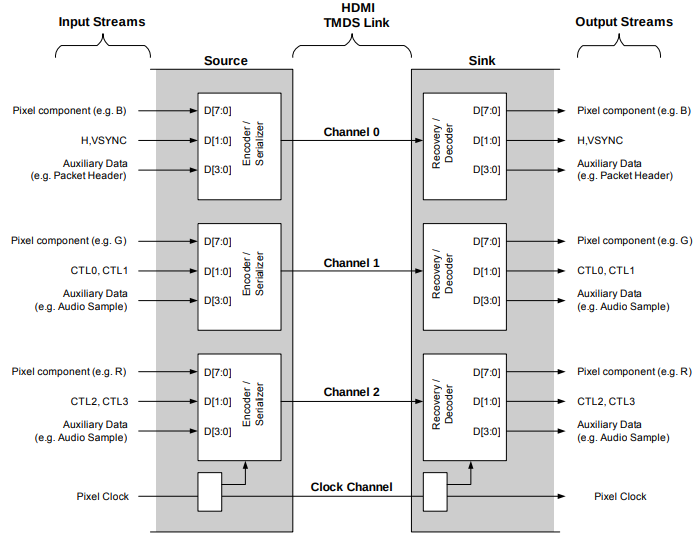

# HDMI-TX-FPGA
## Project Overview
**Description**: A Verilog-based RTL design of an HDMI transmitter design implemented on a  FPGA.<br>
**Purpose**: Interface FPGA with an HDMI display, enabling video data transmission.
### Features (At the moment)
- **Resolution Support**: 640x480p60
- **Color Depth**: 8-bit
- **Pixel Formats**: RGB
- **Compliance**: HDMI 1.3 Compliance
## Overview of HDMI 1.3 Signaling and Encoding Specifications

HDMI (High-Definition Multimedia Interface) employs three **TMDS (Transition Minimized Differential Signaling)** data channels and one TMDS clock channel. Each "channel" represents a differential pair of wires. During each cycle of the TMDS clock channel, all three TMDS data channels transmit a 10-bit character. These data channels include a **TMDS encoder/serializer**, which encodes the input data and serializes it for transmission. The figure below illustrates the architecture of an HDMI transmitter.
For additional details, refer to the [HDMI 1.3 Specification](https://www.hdmi.org/specifications/hdmi1_3).


## HDMI Transmitter Architecture 

The HDMI transmission system consists of three channels (**Channel 0**, **Channel 1**, and **Channel 2**), each responsible for transmitting different types of data over the HDMI link.


### Encoding Schemes

The data for each channel is encoded using specific encoding schemes:

- **Pixel Data Encoding**: 8b/10b TMDS encoding.
- **Auxiliary Data**: 4b/10b TERC4(TMDS Error Reduction) encoding.
- **Control Data**:  2b/10b encoding.

The parallel data from each channel is serialized using a serializer and then transmitted through an LVDS (Low Voltage Differential Signaling) output buffer (OBUF) to the HDMI interface.

### Control Signals
The control signals `vde` (Video Data Enable) and `ade` (Auxiliary Data Enable) determine the type of data being transmitted at any given moment:

| **vde** | **ade** | **Data Period**         |
|---------|---------|-------------------------|
|    0    |    0    | Control Period          |
|    0    |    1    | Auxiliary Data Period   |
|    1    |    0    | Video Data Period       |

### TMDS Channel Architecture


### Channel Data Mapping

Each channel transmits a specific pixel component, auxiliary data, or control data:

| **Channel**  | **Pixel Component** | **Auxiliary Data**                                 | **Control Data**   |
|--------------|---------------------|---------------------------------------------------|--------------------|
| **Channel 0** | Blue               | Packet header (e.g., Audio or extended information) | Hsync, Vsync       |
| **Channel 1** | Green              | Audio Sample or extended information              | CTL0, CTL1         |
| **Channel 2** | Red                | Audio Sample or extended information              | CTL2, CTL3         |
## Hardware
- **Board**: Sipeed Tang Nano 9k .
- **FPGA**: Gowin FPGA (GW1NR-9C)
## Design details (Soon) 
## Project Structure
```
├── Docs
│   ├── hdmi_architecture_overview.png
│   ├── HDMI_TX_architecture.svg
│   └── TMDS_Channel.svg
├── impl
│   ├── gwsynthesis
│   │   ├── RTL-HDMI-Transmitter.log
│   │   ├── RTL-HDMI-Transmitter.prj
│   │   ├── RTL-HDMI-Transmitter_syn_resource.html
│   │   ├── RTL-HDMI-Transmitter_syn.rpt.html
│   │   ├── RTL-HDMI-Transmitter_syn_rsc.xml
│   │   └── RTL-HDMI-Transmitter.vg
│   ├── pnr
│   │   ├── cmd.do
│   │   ├── device.cfg
│   │   ├── RTL-HDMI-Transmitter.bin
│   │   ├── RTL-HDMI-Transmitter.binx
│   │   ├── RTL-HDMI-Transmitter.db
│   │   ├── RTL-HDMI-Transmitter.fs
│   │   ├── RTL-HDMI-Transmitter.log
│   │   ├── RTL-HDMI-Transmitter.pin.html
│   │   ├── RTL-HDMI-Transmitter.power.html
│   │   ├── RTL-HDMI-Transmitter.rpt.html
│   │   ├── RTL-HDMI-Transmitter.rpt.txt
│   │   ├── RTL-HDMI-Transmitter.timing_paths
│   │   ├── RTL-HDMI-Transmitter_tr_cata.html
│   │   ├── RTL-HDMI-Transmitter_tr_content.html
│   │   └── RTL-HDMI-Transmitter.tr.html
│   ├── project_process_config.json
│   └── temp
│       ├── rtl_parser_arg.json
│       └── rtl_parser.result
├── README.md
├── RTL-HDMI-Transmitter.gprj
├── RTL-HDMI-Transmitter.gprj.user
└── src
    ├── encoder.v
    ├── font_bitmap_verilog_rom_table.v
    ├── fonts.v
    ├── Gowin_CLKDIV.v
    ├── Gowin_rPLL.v
    ├── hdmi_test.v
    ├── hdmi_tmds.v
    ├── RTL-HDMI-Transmitter.cst
    ├── RTL-HDMI-Transmitter.sdc
    ├── shift_reg_delay.v
    ├── timing.v
    └── video_generator.v
```
## Uploading the bitstream to FPGA
If you're using a Linux machine and encounter issues loading the bitstream to the FPGA through the GowinEDA programmer (which works well on Windows), you can use the `openFPGALoader` utility. It supports the Tang Nano 9K FPGA and provides an alternative solution.
For Linux Manjaro, you can install `openFPGALoader` using the following command:  
```bash
sudo pacman -S openfpgaloader
```
Then opload the demo to your FPGA.
1. **Navigate to the `impl/pnr` directory**:  
   Open a terminal and move to the directory where the design files are located:
   ```bash
   cd impl/pnr
   ```
   ```bash
   openFPGALoader -b tangnano9k RTL-HDMI-Transmitter.fs
   ```
## Demo 
[Click here to watch the demo](Docs/Demo.mp4)


## Future Work
- Porting the RTL to another FPGA platforms (easy because I used only two platform dependent IP cores (serializer and LVDS IOBUF other code is pure Verilog)).
- Implement a simple Graphics Processing Unit (GPU) to render graphics to the HDMI port.  
- Complete the audio handling functionality to enhance the system's multimedia capabilities.  
- Create detailed documentation to improve usability and understanding of the project.